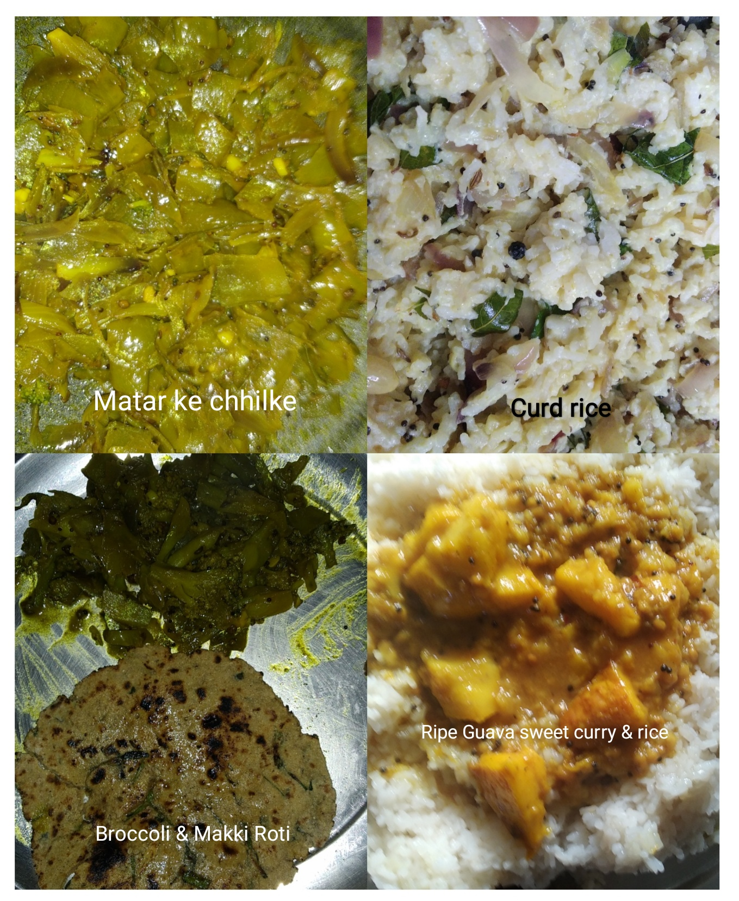
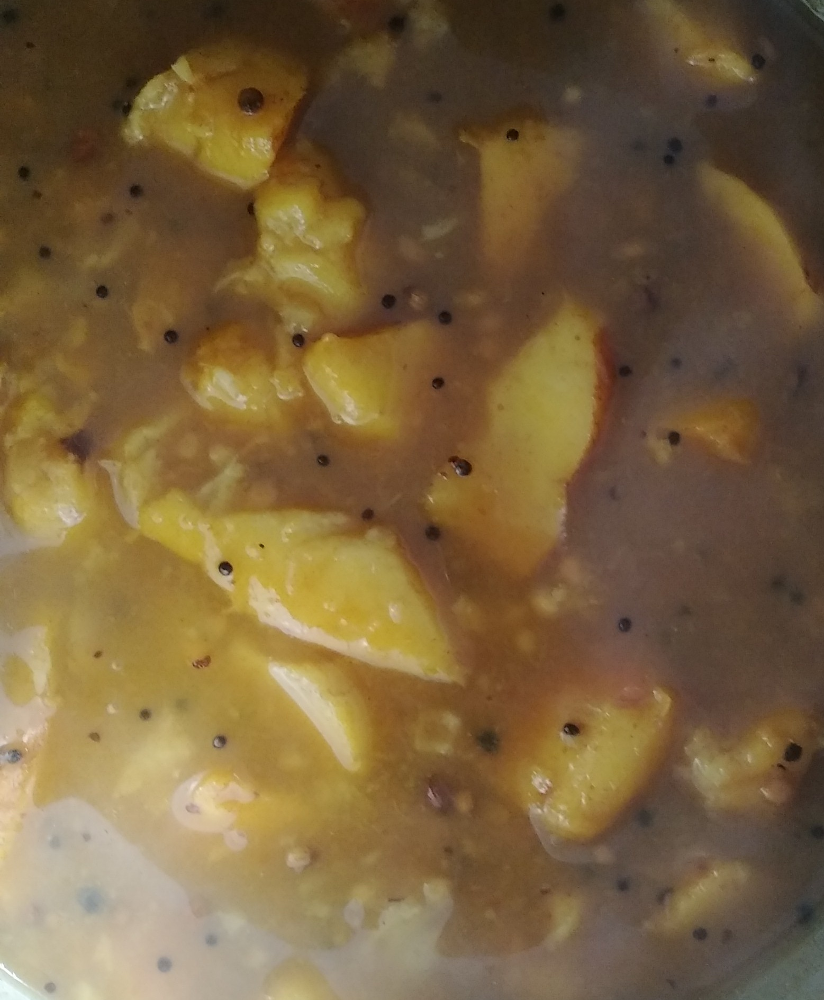
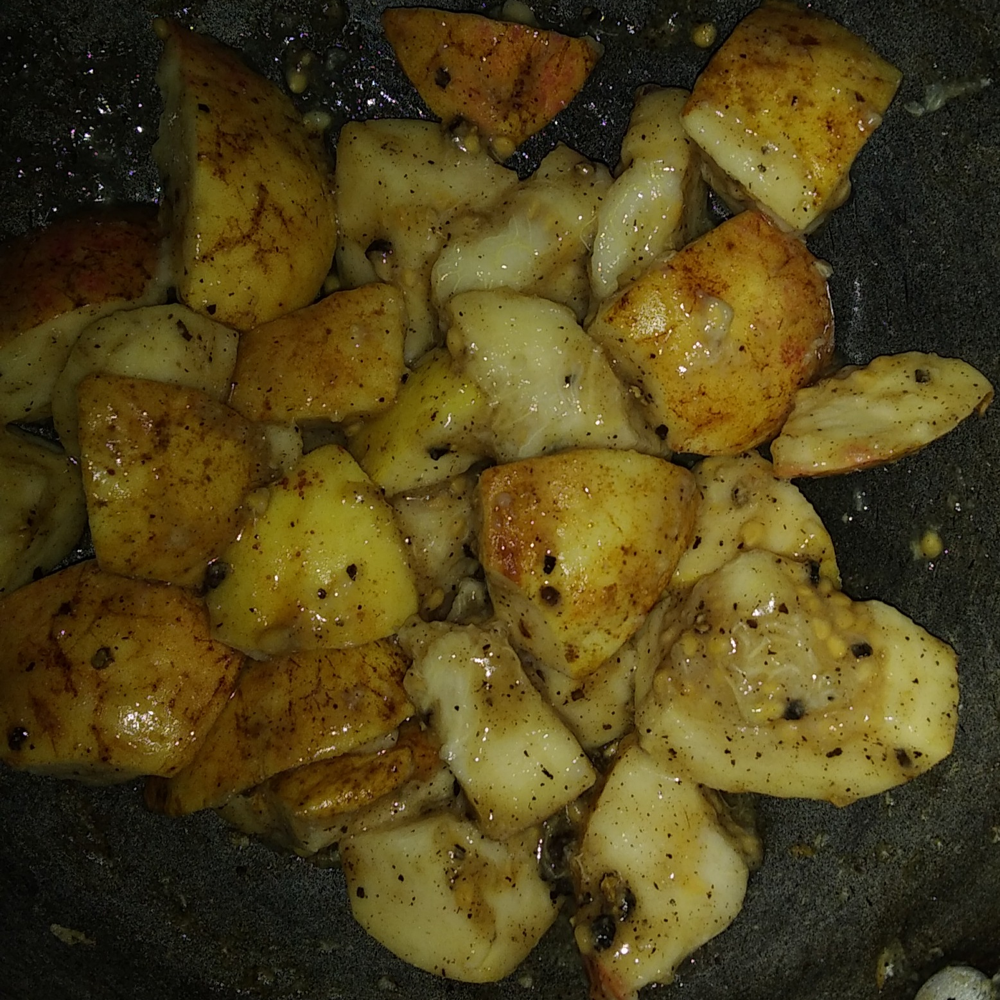

# 2022

## February 

### 2022-02-11

Broccoli Leaves, Cauliflower Leaves, Potato curry 

- Chhaunk: Mustard oil, Dhaniya seeds, Rai seeds, Heeng 
- Add finele chopped leaves and thin slices of potatoes. 
- Salt to taste, Turmeric, Sabji masala
- Miz well, add half glass water, cook for 15-20 minutes on low flamed pressure cooker (in my case, this happened without pressure cooker whistles). 

### 2022-02-07

Ripe guava sweet sauce style curry.

- Almost Zero Oil Cooking: One teaspoon of mustard oil for Chhaunk. Dhaniya seeds, Rai seeds, Saunf. 
- Medium sized pieces of ripened guavas.
- Salt, Curry masala, Turmeric as per taste. Crushed black pepper.
- _Shakkar_ for sweetness as per taste. 
- Ten minutes cooking in pressure cooker on medium sized flame. 

### 2022-02-06

Hot Ripe Guava Salad 🥗

- Put guava pieces, salt, chopped black pepper, chaat masala, lemon pickle syrup two tea spoons, _shakkar_ one tea spoon in kadhai on high flame and keep tossing for 60-120 seconds. 

