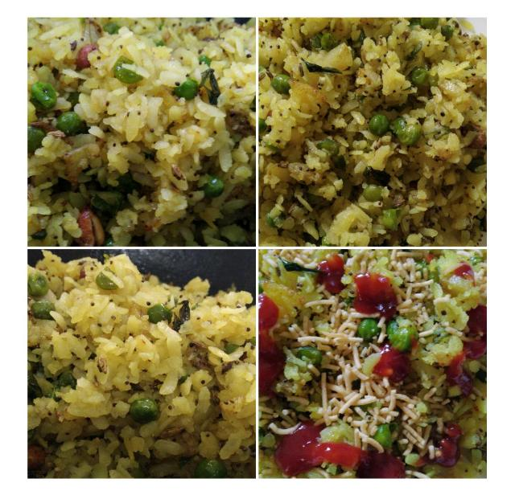
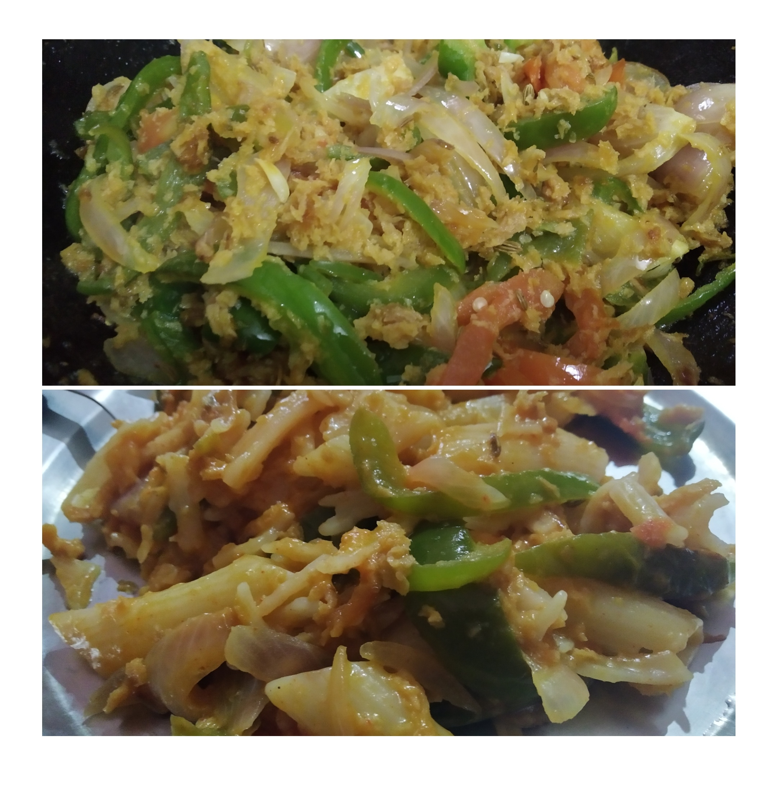

# My Kitchen Cookbook

##  Abbreviations

MFT: Made First Time

##  2020

###  2020-05-25

Sweet cheela MFT

###  2020-05-30

Shimla mirch pakoras with base of potato all grated MFT

###  2020-06-05

Pear Jam MFT (not perfect)

###  2020-06-08

Lady finger with soya bean nutri curry MFT

###  2020-06-18

Chilly potato pasta MFT

###  2020-06-21

Fried Momos MFT

###  2020-07-02

(Today's cooking secret: Black pepper, little lemon juice)

#### Raw mango (unpeeled) chutney/jam

 1.  Completely dried, cooked well to leave surface of container properly (this happened first time today). 
 2. MFT unpeeled one. 
 
#### Pear jam

 1.  Left surface of container after getting adequately cooked. 
 2. Properly MFT. 

###  2020-07-05

Mint cheela MFT

 1.  Toppings: onion and tomato cooked separately in kadhai. Used leftover mashed aloo in it (from morning aloo Ka paranthas). 
 2. Besan, wheat aata used both. 
 3. Curry leaves, raw mango, mint chutney mixed in batter itself. 

###  2020-07-08

Kofte ki kadhi MFT

 1.  Veggies: Lauki, one brinjal, one onion and one potato (just for base and crispy frying)
 2. Besan batter containing all spices with jeera for better taste and crispiness. 
 3. Kadhi made with pakoras and besan already mixed in buttermilk for long. 

### 2020-07-10

Chinese style jackfruit curry MFT

 1.  Tomato, onion, capsicum in making. 

###  2020-07-23

Mango parantha MFT

 1.  Grind two mangoes for paranthas for 4 people. 
 2. Chop one onion. 
 3. After grinding mangoes, add and grind onion, salt, red pepper, kasuri methi, (other spices as required). Make a fine paste. 
 4. Knead this paste with dough. 
 5. Don't add water initially. Once all paste is used in dough and water is needed, only then  add. 
 6. Different shapes and styles of paranthas can now be made. 

### 2020-07-28

Mango barfi MFT Self invention

 1.  Mango peels taken off. Pulp grinded in processor to make a pury. 
 2. Heat in little ghee on kadhai. 
 3. Add some sugar. Not too much. 
 4. In another kadhai or pan heat in ghee a bowl of besan. (Better to sieve and use. I didn't do that. So I can understand what goes wrong.)
 5. After besan changes colour add in mango pulp. Mix both well. 
 6. Make into a thick dough. 
 7. Brush little ghee on a plate. 
 8. Add dough and press in order to give shape according to vessel. 
 9. After few minutes use knife to give diamond shape before refrigerating. 
10. Taste after sometime. 

Tomorrow make using chaashni as seen and learned. 

### 2020-08-20

Sambhar MFT

 1.  Daal, potato, onion, tomato, lady finger, arbi 
 2. Chaunk: mustard oil, black pepper, dhaniya, saunf, tej patta, Rai, curry leaves, sambhar powder
 3. Imli juice 
 4. All mixed together. 
 
### 2020-08-23

Galgal pickle MFT

 1. Wash galgals. 
 2. Dry them. Rub with dry cloth to remove any water. 
 3. Wash or make ready glass jar for pickle. Dry it completely. 
 4. Cut galgals in adequate sized pieces removing the seeds. 
 5. I threw seeds in soil not dustbin. 
 6. Add salt and red chilly powder in pieces of galgals. 
 7. Mix everything well by covering the bowl with a plate and shaking up and down. 
 8. You can keep it for day in this bowl. Or transfer this mixture immediately to the glass jar if already dried. 
 9. I transferred after a day as glass jar wasn't dried. 
10. Today it's prepared. 

### 2020-09-22

Making batter for dosa

 1.  I used all the mota rice that was remaining. This was nearly 5 and half cups to 6 cups. 
 2. I similarly used about 2 to two and a half cups of Urad Dal. 
 3. These were washed and soaked separately in two different utensils. 
 4. I also soaked about two spoons of methi seeds in the container having dal. 
 5. Grinded rice separately in the mixture after about five hours of soaking. 
 6. After that I grinded dal and methi seeds separately and mixed these with the rice batter. 
 7. It came into a very smooth batter. Hopefully should be ready to be made into a dosa after five to six hours of standing. 
 
### 2020-11-02

Saag 
4 types of saag, MFT

1. Radish leaves, Methi, Sarson, Palak washed, steamed, grinded, some not grinded and cut. 
 2. Two onions chopped. One ginger piece grated. Two tomatoes grinded. 
 3. Saunf used in tadhka. Heeng in more quantity. 
 4. Slowly cooked in big kadhai. 
 5. Other steps in process are usual as in other curries. 

### 2020-11-06

MFT

Added a pinch of salt while kneading dough to make process it soft in no time. 

I have seen the results, this is true that adding a pinch of salt makes the kneading process smoother and easier. 

Note - For best results use the  kneaded dough instantly. Do not keep it for later. Incase you keep it for later slightly knead it again with lukewarm water. 

### 2020-12-26

MFT

Boil pasta and wash in cold water. They'll be extra soft. 

A topping of pickle oil after pasta is prepared gives it a tangy twist. 

## 2021

### 2021-01-28

MFT Mandua Atta Paranthas

Note: 

 1.  Use some buffalo ghee in winters when kneading dough. 
 2. No need to add salt to the dough. 
 3. Warm water and ghee are sufficient to make dough soft. 
 4. Use millets. 

 1.  Mixed with wheat. 
 
### 2021-02-13 

MFT Mustard Sambhar 

Ingredients: 
  - Mustard leaves
  - Soya leaves
  - 2 onions
  - 1 carrot
  - 3 turnips
  - 2 slices of kaddu
  - Ginger grated
  - Garlic 
  - Lentils: Arhar, Moong mixed

Made exactly as it is made. 

Had put some soya in Chhaunk too. 

### 2021-02-24

MFT Channa Urad Lentil Sambhar

Ingredients: 

  - 1 potato
  - 2 onions
  - 1 tomato
  - 1 carrot
  - 1 capsicum
  - 1 piece of cauliflower
  - Few slices of garlic

Preparation method same. 

### 2021-04-07

MFT BOM (Beetroot Onion Mint) Salad

  - 1 big beetroot grated
  - 2 medium size onions chopped
  - 10-12 mint leaves finely chopped
  - 1/2 lemon's juice 
  - black salt 
  
All mixed together and served with food. 

### 2021-04-11

Maggi tips

#### Atta noodles

  - Cook in pressure cooker getting 3 whistles. 
  - Put chopped one onion in two Patanjali packets. 
  - Add pinch of salt, red chilli powder, turmeric. 
  - Add about three spoons of tomato ketchup. 
  - Water just for boiling. 
  
#### Maida noodles

Can be cooked in pan. Need relatively less boiling. 

### 2021-04-25

Bitter gourd dry curry

  - Curry leaves one bowl 
  - One tomato
  - 2 small onions
  - 2 green chillies
  - All of above sauted together in rai seeds. 
  - Then 2 bitter gourd first cut from middle then further chopped into slices to be added and sauted all together. 
  - Add salt, turmeric, red chilli powder, as per taste. 
  - When everything is cooked, curry leaves would d

### 2021-06-20

Pudina paranthas

Knead dried pudina with ajvain in aata. Make paranthas. 

Note - Mother doesn't take curd. Misses on pudina. Thus pudina being kneaded in wheat. 

### 2021-06-27

Aloo Bottle guard Onion Capsicum curry (gravy) MFT

  - Constraint: No tomatoes
  - No garlic used. 
  - 3 potatoes, 1 onion, 1 capsicum, a big piece of bottle guard
  - Chhaunk: Jeera, Methi seeds, Saunf, Heeng 

### 2021-06-30

Chholey in cooker in one go MFT

  - Chhaunk in cooker first: Saunf, Heeng, Methi seeds, Dhaniya, Rai, Jeera, Tomato Onion Garlic paste
  - Add whole day soaked Chholey
  - Cook on low flame (5 whistles. I took remaining 2 whistles on high flame due to time shortage) 
  

And it's made! Boiling, Chhaunk, etc need not be in different steps. Heavenly taste! 

### 2021-07-14

Pear Juice / Pear Lemon Squash MFT 

  - Peel off four pears, cut into slices, remove seeds. 
  - Squeeze half lemon (or as per taste).
  - Add sugar, salt, black salt, chat masala. 
  - Add 3-4 glasses of cold water. For squash/juice/smoothie.  
  - Mix in food processor. 
  - Serve fresh. 

### 2021-07-17 

Lemon pickle MFT

  - Half kg lemons washed and peels dried. 
  - 4 spoons of sugar
  - 1-1.5 spoons of salt
  - About 1-2 spoons of black pepper (crushed) 
  - 7-8 harad
  - One big ginger piece grated
  - 1 spoon garam masala 

Mixed and bottled in glass jar. 

###  2021-09-03

Raw Bananas Potato (gravy) curry MFT

- 3 bananas
- 3 potatoes
- Onion, tomato, garlic, ginger grinded
- Chhaunk spices, less ghee used 
- 5 whistles in pressure cooker on low flame

### 2021-09-08

Nutri Nuggets Pasta MFT

- Nutri Nuggets (Soyabean) soaked, grinded
- 3 capsicums
- 2 onions
- 2 tomatoes
- All cooked, salt added. Pasta added. Ketchup, mayonnaise added. Mixed well. Cooked for 2 minutes. 

